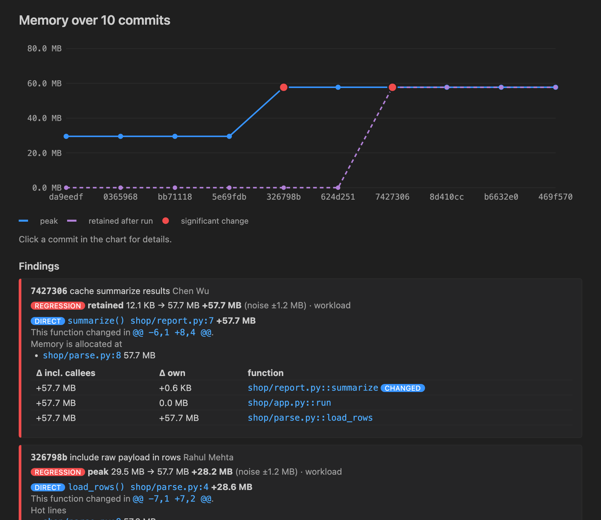

# memblame: git blame for memory

Find **the commit and the function** that made your Python code use more memory.

memblame runs your own workload (a pytest test, a script or a function) at several git
commits, measures memory with `tracemalloc`, and maps any growth to the function and the
diff hunk that caused it.

```
$ memblame range main~9..main -w call:shop.app:run
workload  (median of runs; ▲ = significant change; measured 7 of 10 commits)
  commit         peak      Δpeak    retained       Δret  author / subject
  da9eedf     29.5 MB                11.4 KB             Asha Rao       initial pipeline
  ...
  326798b     57.7 MB  +28.2 MB▲     12.3 KB   +0.1 KB   Rahul Mehta    include raw payload in rows
  7427306     57.7 MB   +0.4 KB      57.7 MB  +57.7 MB▲  Chen Wu        cache summarize results

Findings:
  7427306  retained +57.7 MB  "cache summarize results"
      direct: shop/report.py:7 summarize()  +57.7 MB
        changed in shop/report.py @@ -6,1 +8,4 @@
        memory allocated at shop/parse.py:8  57.7 MB
  326798b  peak +28.2 MB  "include raw payload in rows"
      direct: shop/parse.py:4 load_rows()  +28.6 MB
        changed in shop/parse.py @@ -7,1 +7,2 @@
        hot line shop/parse.py:8  57.3 MB
```

There is also a **VS Code extension** (in `vscode-ext/`) that shows a timeline, CodeLens
above the blamed function, and a one-click "Memory vs HEAD" on every pytest test.



## Install

```
pip install memblame        # or: pipx install memblame
```

No dependencies: the core is standard-library only. Python 3.10+.

## Usage

```
memblame diff                     # working tree (uncommitted changes) vs HEAD
memblame diff main feature        # two revisions
memblame range main~50..main      # timeline over a range (adaptive; --all for every commit)
memblame bisect --good v1.2 --bad HEAD --threshold +20MB
memblame run HEAD                 # one revision, with top allocating functions
```

Pick what to run with `-w` (or `workload` in `[tool.memblame]` in `pyproject.toml`):

| workload | measures |
|---|---|
| `pytest:tests/test_big.py::test_load` | one test (only the test itself: setup, call, teardown) |
| `pytest:tests/test_big.py` | each test in the file, separately |
| `script:bench/run.py --n 10` | a script; the path may be absolute (outside the repo), which keeps the workload identical at every commit |
| `call:mypkg.pipeline:main` | a function |

Useful options: `--json` (stable schema 1, used by the extension), `--runs N`,
`--nframe N` (traceback depth), `--pythonpath src`, `--python .venv/bin/python`,
`--no-cache`. Exit code `3` means a significant memory increase was found, which is
handy in CI.

```toml
# pyproject.toml
[tool.memblame]
workload = "pytest:tests/test_pipeline.py"
runs = 3
pythonpath = ["src"]
```

## How it works

1. Each commit is checked out into a temporary `git worktree` (your working tree is never
   touched) and the workload runs in a fresh subprocess of **your project's interpreter**.
2. Fast runs measure **peak** and **retained** (still allocated after the run) traced memory.
   They repeat until two runs agree, and the median is reported. `tracemalloc` counts
   are nearly deterministic: on real projects run-to-run noise was a few KB.
3. A change counts only if it exceeds the noise band: `max(2 × spread, 2 % of peak, 64 KiB)`.
4. Only for commits around a significant change, one **attribution run** records
   tracebacks. A profile hook snapshots memory when it approaches the known peak, and each
   allocation is credited to project functions: *own* bytes (allocated in the function)
   and *incl. callees* bytes.
5. The function deltas are matched against `git diff -U0` hunks, on the new side for
   growth and the old side for memory that went away.
   * **direct**: the function whose code changed accounts for the growth.
   * **indirect**: memory grew in code that did not change (the cause is a caller, data or
     config); the changed functions are listed.
6. `range` is adaptive: it measures both ends and only subdivides segments whose ends
   differ, so the work is roughly log₂(N) per change. Results are cached per commit in
   `.memblame/cache/`, keyed by the commit plus the interpreter, installed packages,
   settings and memblame version.

## Honest limits

* `tracemalloc` sees memory allocated through Python's allocators. numpy reports its
  buffers to tracemalloc, so arrays are counted. Native libraries that call `malloc` directly
  are not.
* Tracing is slow: the fast runs are several times slower than normal, and the attribution
  run can be 10–40× slower on allocation-heavy or deeply recursive code. Use small,
  deterministic workloads.
* The environment is fixed: all commits run with the dependencies currently installed. If
  your dependencies changed across the range, results may not be comparable.
* If your project is installed so that imports resolve **outside** the checked-out commit
  (for example `pip install -e .` with a `src/` layout and no `--pythonpath`), memblame
  detects it and reports `invalid environment` instead of wrong numbers.
* Adaptive `range` can miss a change that is exactly undone later within one unsplit
  segment. Use `--all` to measure every commit.
* Attribution names where memory was **allocated**. For "kept alive too long" problems it
  still points at the changed function through the *incl. callees* numbers, and it
  shows where the memory was allocated.

## Tested on real projects

On markdown-it-py (`v2.0.0..HEAD`, 136 commits, 19 measured) memblame found three
memory improvements, each in a commit whose purpose explains it:
"Replace character codes with strings" (peak −1.6 MB, −17 %, from removing a per-character
`tuple(ord(c) ...)`), "Move `Token` to dataclass" and "`__slots__` for dataclasses". It
flagged nothing in the ~130 other commits. See `PROJECT.md` for details.

## Development

```
uv venv && uv pip install -e . pytest ruff
pytest            # unit + end-to-end tests against generated git repos
ruff check src tests
python tests/fixture_repo.py /tmp/demo   # a repo with two planted regressions
```

## License

MIT
