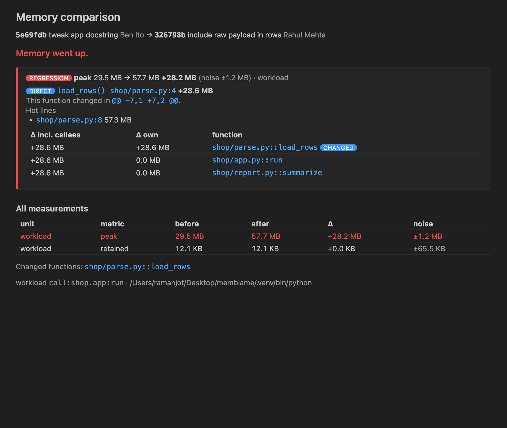

# MemBlame: git blame for memory

**Find the commit and the function that made your Python code use more memory.**

MemBlame runs one of your pytest tests, scripts or functions at several git commits,
measures memory, and points at the function and the diff hunk responsible.

## What you can do

- **Memory vs HEAD**: a CodeLens above every pytest test compares the test's memory with
  and without your uncommitted changes. This answers "did my change make memory worse?"
  before you commit.
- **Compare two commits**, with a verdict: which function grew, whether it is the code you
  changed (*direct*) or a knock-on effect (*indirect*), and the hot lines.
- **Analyze a commit range**: a timeline of peak and retained memory. It measures the ends
  and only subdivides where memory changed, so 100 commits usually needs only a handful of
  measurements.
- **Find the commit that increased memory**: bisect with an optional threshold
  (`200MB`, `+20MB`, `+10%`).
- After a run, the blamed function gets a CodeLens (`↑ peak memory +28.2 MB`) and hot
  lines are annotated inline.

## Getting started

1. Open a Python project that is a git repository.
2. Select your project's interpreter with the Python extension, or set `memblame.pythonPath`.
   MemBlame runs your code with it, so your dependencies must be installed there.
3. Click **Memory vs HEAD** above a test, or run **MemBlame: Choose Workload…** and then any
   MemBlame command from the Command Palette.

Nothing needs to be installed with pip: the engine is bundled with the extension and uses
only the Python standard library.

## Settings

| Setting | Default | |
|---|---|---|
| `memblame.workload` | | `pytest:tests/test_x.py::test_y`, `script:path [args]` or `call:module:function` |
| `memblame.runs` | `3` | max measured runs per commit (stops early once two runs agree) |
| `memblame.nframe` | `16` | traceback depth for attribution |
| `memblame.pythonPath` | | interpreter override |
| `memblame.importPaths` | auto | e.g. `["src"]` |
| `memblame.defaultRange` | `HEAD~20..HEAD` | |
| `memblame.testCodeLens` | `true` | show "Memory vs HEAD" above tests |

## How it works and its limits

Each commit is checked out into a temporary git worktree (your files are never touched) and
measured with Python's `tracemalloc`: peak memory and memory still held after the run. The
median of runs is compared against a noise band. Only commits around a real change get a
slower attribution run that maps memory to functions and to the lines in `git diff`.

- `tracemalloc` counts Python allocations and numpy arrays, but not native libraries that
  call `malloc` directly.
- Tracing slows code down (several times, more for attribution), so choose a small,
  deterministic test.
- All commits run with your currently installed dependencies.
- If imports resolve outside the checked-out commit (for example an editable install with
  a `src/` layout), MemBlame reports **invalid environment** instead of wrong numbers. Set
  `memblame.importPaths`.

The same engine is available as a CLI (`pip install memblame`) for CI and terminals.
